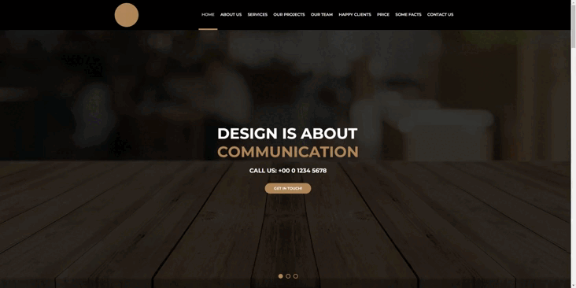

<h1 align="center"> Awax</h1>

  <a href="#tecnologias-">Tecnologias</a>&nbsp;&nbsp;&nbsp;|&nbsp;&nbsp;&nbsp;
  <a href="#sobre-">Sobre</a>&nbsp;&nbsp;&nbsp;

 
Landing page

## Tecnologias 🚀 

Esse projeto foi desenvolvido com as seguintes tecnologias:

- HTML
- CSS

## Sobre 📖

### Descrição
Landing page voltada para agências de comunicação visual, marketing e fotografia.

### Objetivo
Praticar conceitos importantes sobre HTML e CSS desenvolvendo uma landing page.

## 📫 Como contribuir
<!---Se o seu README for longo ou se você tiver algum processo ou etapas específicas que deseja que os contribuidores sigam, considere a criação de um arquivo CONTRIBUTING.md separado--->
Para contribuir com Awax, siga estas etapas:

1. Bifurque este repositório.
2. Crie um branch: `git checkout -b <nome_branch>`.
3. Faça suas alterações e confirme-as: `git commit -m '<mensagem_commit>'`
4. Envie para o branch original: `git push origin <nome_do_projeto> / <local>`
5. Crie a solicitação de pull.

Como alternativa, consulte a documentação do GitHub em [como criar uma solicitação pull](https://help.github.com/en/github/collaborating-with-issues-and-pull-requests/creating-a-pull-request).

---

Feito com ♥ by [David Augusto](https://github.com/DavidAugustoo)
